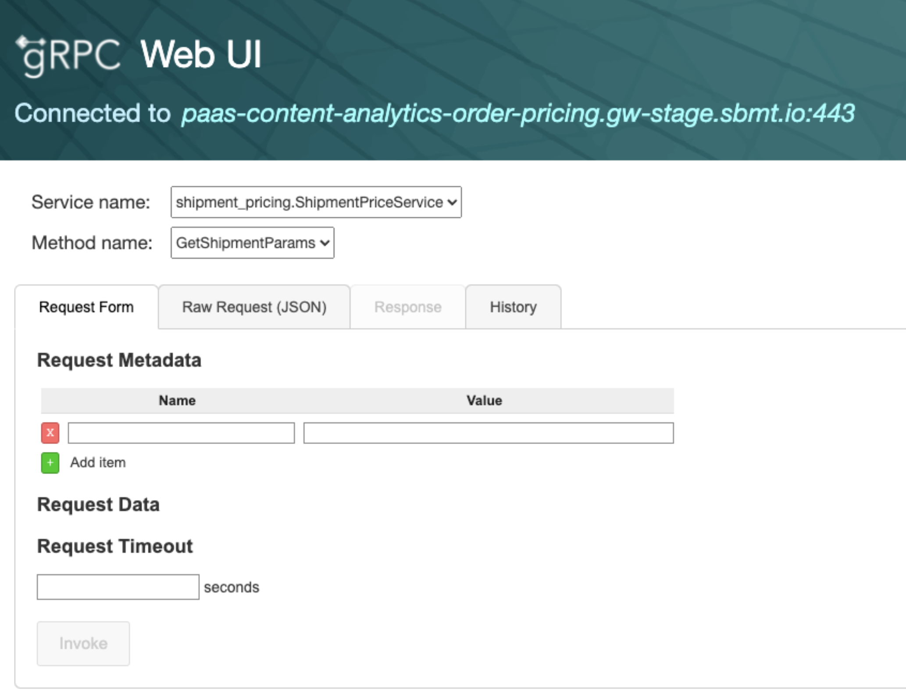

# How-to testing gRPC at the DAST stage

<aside class="mdx-author" markdown="1">
![@nkashapov][1]

<span>__Kashapov Niaz__ · @nkashapov (moderator: __Ermolaev Nikita__ · @zilborg)</span>
<span>
:octicons-clock-24: 10 min read
</span>
</aside>

[1]: https://avatars.githubusercontent.com/u/31585766

## gRPC and DAST tools

Many popular DAST tools, like ZAP, Burp, Nikto, Wapiti (etc.), works appropriately only with HTTP/1.1 protocols.
This is a short note about connecting CI/CD scanners or SSDLc processes to the gRPC API gateway. 

If you have a different implementation, please share your experience [here](https://github.com/Zilborg/zilborg.github.io/discussions/8).   

### Few words about gRPC

gRPC is a high-performance Remote Procedure Calls (RPC) framework developed by Google provided by HTTP/2. 

Using one (live) TCP connection and [protobuf protocol](https://developers.google.com/protocol-buffers) saves traffic and server resources.

The significant feature of gRPC is the transfer of serialized data in binary format. The **protobuf** protocol strongly typifies fields and data format.

### The trouble

The main problem is that the popular DAST tools do not correctly work with gRPC due to typifying fields and data format. In other words, its does not support **protobuf** serialization.

### So, and?

It has been discovered that the following tools support gRPC communication by default:

- [grpcurl](https://github.com/fullstorydev/grpcurl) (cmd)
- [evans](https://github.com/ktr0731/evans) (cmd) 
- [bloomrpc](https://github.com/bloomrpc/bloomrpc) (gui)

However, the most popular solutions for development and working with a request [Postman](https://www.postman.com/product/what-is-postman/) (hi QA 👋) or [BurpSuite](https://portswigger.net/burp) (hi QA and AppSec 👋) do not support gRPC requests by default. 

#### By the researching, we conclude

By design, I have discovered ways to create a reverse proxy endpoint for proxy data from HTTP/1.1, aka REST API, to gRPC API.

🚩 I have tried to proxy data from client (Postman/Burp) to **bloomrpc** and gRPC gateway. It's hurt because the client required specific libs.

🚩 I have tried to proxy data from client (Postman/Burp) to [grpc-gateway](https://github.com/grpc-ecosystem/grpc-gateway) and gRPC gateway. It also has issues with regenerating `.proto` files for navigating to API endpoints and paths.

🚩 I have tried to proxy data from client (Postman/Burp) to [grpc-json-proxy](https://github.com/jnewmano/grpc-json-proxy) and gRPC gateway. In this way, I should insert lib to my project for adequately working. It's not a practical case for testing by engineers.  

✅ [grpcui](https://github.com/fullstorydev/grpcui) is the easiest way to reverse proxy gRPC endpoint and friendly Postman, Burp, and ZAP. However, it would help if you remembered that **grpcui** provides only one service. If you have several gRPC APIs, you should up several **grpcui** processes.

### Using

**Install**
``` bash
go install github.com/fullstorydev/grpcui/cmd/grpcui@latest
```
!!! note
    You should [add it to GOPATH](https://golang.org/doc/gopath_code) or use [last version of Go](https://lakefs.io/managing-multiple-go-versions-with-go/).

**Up proxy**

``` javascript 
grpcui -vvv/* (1) */ -insecure/* (2) */ domain-address:port/* (3) */
```

1. `-vvv` - maximum debug logs
2. `-insecure` - without TLS or `-plaintext` (same as `-insecure`) 
3. `domain-address:port` - target, by default port is 443


With success initialization, the service opens a localhost service with the UI for testing gRPC.



!!! note 
    - **Request form** - configure metadata and manual fill fields from `.proto` file. 
    - **Raw Request** - you can insert raw JSON to send request to gRPC API.

*Invoke* action sends a request with POST method. **grpcui** converts HTTP request with JSON into gRPC request to selected from the form gRPC method. The response also converts from gRPC to HTTP JSON data.

!!! tip "Security issue."
    All requests can be viable and analyzed via proxy tools such as Burp Pro or ZAP. 
    The crawler (Burp) or spider (ZAP) do not work well, but you can generate all routes by *curl* way before scan 😉.    


For comments and discussion welcome [here](https://github.com/Zilborg/zilborg.github.io/discussions/8).
--8<-- "docs/assets/abbr.md"

